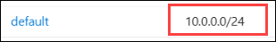
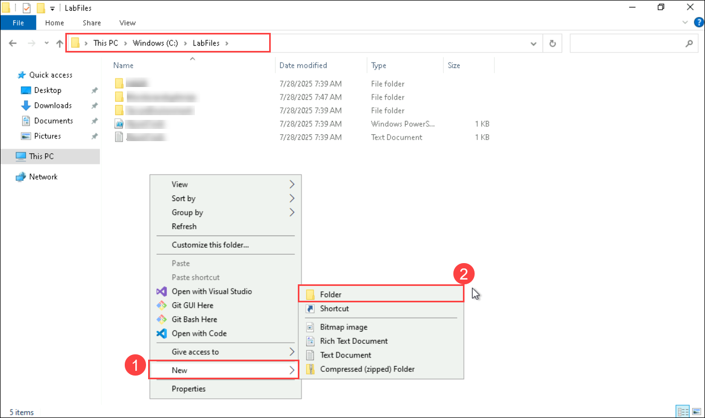
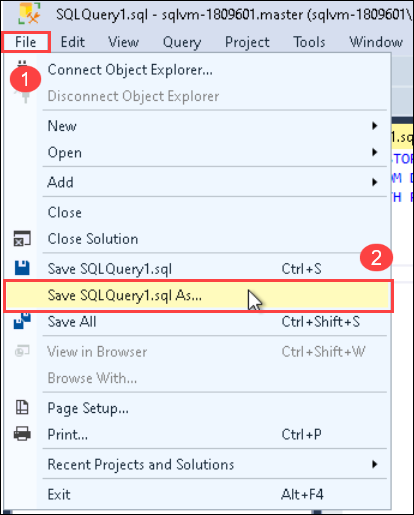
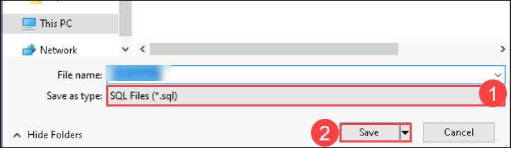

# Lab 02: Provision an Azure SQL Database

## Lab scenario
Students will configure basic resources needed to deploy an Azure SQL Database with a Virtual Network Endpoint. Connectivity to the SQL Database will be validated using SQL Server Management Studio from the lab VM.

As a database administrator for AdventureWorks, you will set up a new SQL Database, including a Virtual Network Endpoint to increase and simplify the security of the deployment. SQL Server Management Studio will be used to evaluate the use of a SQL Notebook for data querying and results retention.

## Lab objectives

In this lab, you will complete the following tasks:

- Task 1: Create a Virtual Network
- Task 2: Provision an Azure SQL Database
- Task 3: Enable access to an Azure SQL Database
- Task 4: Connect to an Azure SQL Database in SQL Server Management Studio
- Task 5: Query an Azure SQL Database with a SQL Notebook

## Estimated timing: 45 minutes

## Architecture 

You will be creating a Virtual Network to establish a secure environment for resources. An Azure SQL Database is then provisioned and configured to allow access within this network. Finally, the database is accessed using SQL Server Management Studio, where queries are executed through a SQL Notebook for data analysis and management.

## Architecture diagram


### Task 1 - Create a Virtual Network

In this task you will be creating a Virtual Network in Azure Portal.

1. In the Azure portal home page, select the **left hand menu.**

     

2. In the left navigation pane, click **Virtual Networks**
     
     

3. Click **+ Create** to open the **Create Virtual Network** page. On the **Basics** tab, complete the following information:
     
   **Note** : **Please make sure not to include additional spaces at the end when copying the parameters!!**
     
     - **Subscription:** Use existing subscription
     - **Resource group:** **contoso-rg-<inject key="DeploymentID" enableCopy="false"/>** **(1)**
     - **Name:** **lab02-vnet** **(2)**
     - **Region:** <inject key="location" enableCopy="false"/> **(3)**

       

4.  Click **Review + Create**, review the settings for the new virtual network, and then click **Create**.

5. Configure the virtual network’s IP range for the Azure SQL database endpoint by navigating to the virtual network created, and on the **Settings** pane, click **Subnets**.
     

6. Click on the **default** subnet link. Note that the **Subnet address range(10.0.0.0/24)** you see might be different.

     

7. Click on **Service Endpoints(1)** from left pane, under Add service endpoints expand the **Services** drop down, select **Microsoft.Sql(2)**, and then select **default(3)** under Subnets then click on **Add(4)**.

   

### Task 2 - Provision an Azure SQL Database

In this you will be creating an Azure SQL Database with SQL authentication, using a private endpoint for secure network connectivity within a virtual network.

1. From the Azure Portal, search for **SQL databases(1)** in the search box at the top, then click **SQL databases(2)** from the list of options.

    

2. On the **SQL databases** blade, select **+ Create**.

    

3. On the **Create SQL Database Server** page, select the following options on the **Basics** tab and then click **Next: Networking**.
     
     - **Subscription(1):** Use existing subscription
     - **Resource group(2):** **contoso-rg-<inject key="DeploymentID" enableCopy="false"/>**
     - **Database Name(3):** AdventureWorksLT
     - **Server:** click on **Create new(4)** link.
     
     

     -  The **Create SQL Database Server** page will open. Provide the server details as follow:
          - **Server name:** dp300-lab-<inject key="DeploymentID" enableCopy="false"/> **(1)**
          - **Location:**  <inject key="location" enableCopy="false"/> **(2)**
          - **Authentication method:** Use SQL authentication **(3)**
          - **Server admin login:** dp300admin **(4)**
          - **Password:** dp300P@ssword! **(5)**
          - **Confirm password:** dp300P@ssword! **(6)**

          Your **Create SQL Database Server** page should look similar to the one below. Then click **OK (7)**.

     

      -  Go back to the **Create SQL Database** page, make sure **Want to use Elastic Pool?** is set to **No**.
      -  Keep **Workload environment**  it as default **Production**.
      -  On the **Compute + Storage** option, click on **Configure database** link. On the **Configure** page, for **Service tier** dropdown, select **Basic**, and then **Apply**.

     

      >**Note:**  Make note of this server name, and your login information. You will use it in subsequent labs.

4. For the **Backup storage redundancy** option, keep the default value: **Geo-redundant backup storage**.

5. Then click **Next: Networking**.

6. On the **Networking** tab, for **Connectivity method** option, click the **Private endpoint** radio button.

    

7. Then click the **+ Add private endpoint** link under the **Private endpoints** option.

    

8. Complete the **Create private endpoint** right pane as follows:

     - **Subscription:**  Use existing subscription **(1)**
     - **Resource group:**  **contoso-rg-<inject key="DeploymentID" enableCopy="false"/>(2)**
     - **Location:** <inject key="location" enableCopy="false"/> **(3)**
     - **Name:** DP-300-SQL-Endpoint **(4)**
     - **Target sub-resource:** SqlServer **(5)**
     - **Virtual network:** lab02-vnet(contoso-rg-<inject key="DeploymentID" enableCopy="false"/>) **(6)**
     - **Subnet:** default **(7)**
     - **Integrate with private DNS zone:** Yes **(8)**
     - **Private DNS zone:** keep the default value **(9)**
     - Review settings, and then click **OK(10)**

       

9. The new endpoint will appear on the **Private endpoints** list.

    

10. Click **Next: Security**, and then **Next: Additional settings**.

11. On the **Additional settings** page, select **Sample** on the **Use existing data** option. Select **OK** if a pop-up message is displayed for the sample database.

    

12. Click **Review + Create**.

13. Review the settings before clicking **Create**.

    >**NOTE:** deployment will take time.

14. Once the deployment is complete, click **Go to resource**.

> **Congratulations** on completing the task! Now, it's time to validate it. Here are the steps:
- Hit the Validate button for the corresponding task. If you receive a success message, you can proceed to the next task. 
- If not, carefully read the error message and retry the step, following the instructions in the lab guide.
- If you need any assistance, please contact us at cloudlabs-support@spektrasystems.com. We are available 24/7 to help you out.
     
     <validation step="821cad36-93f1-4c9f-9db3-e7c82d22235d" />
  
### Task 3 - Enable access to an Azure SQL Database

In this you will enable access to the Azure SQL Database by adding your IP address to the firewall and allowing Azure services to connect to the server.

1. From the **SQL database** page, select the **Overview** section, and then select the **Server name**.

    

2. On the SQL servers navigation blade, select **Networking** under the **Security** section.

    

3. On the **Public access** tab, select **Selected networks (1)**, and then check the **Allow Azure services and resources to access this server (2)** property. Click **Save (3)**.

    
    
    >**Note:** If you receive the failed Notification as shown in the below image please perform the previous three steps again.
   
    
    
    
### Task 4 - Connect to an Azure SQL Database in SQL Server Management Studio

Use SQL Server Management Studio (SSMS) to connect to the Azure SQL Database and enabling encryption. Once connected, you can query and manage the database.

1. On the Azure portal, select the **SQL databases** in the left navigation pane. And then select the **AdventureWorksLT** database.

2. Copy the **Server name** value from the Overview page.

     

3. Launch SQL Server Management Studio from the lab VM by searching for **SQL Server Management(1)** in the search box and select **SQL Server Management Studio Studio Management Studio 19** 

     

4. In the Connect to Server dialog pop-up, paste the **Server name(1)** value copied from the Azure portal.

5. In the Authentication dropdown, select **SQL Server Authentication(2)**.

6. In the Login field, enter **dp300admin(3)**.

7. In the Password field, enter the password **dp300P@ssword!  (4)**.

8. Select **Connect(5)**.

    

9. SQL Server Management Studio will connect to your Azure SQL Database server. You can expand the server and then the Databases node to see the AdventureWorksLT database.

### Task 5 - Query an Azure SQL Database with SQL Server Management Studio

Connect to the Azure SQL Database using SQL Server Management Studio (SSMS) with the server name, login, and password and run queries to interact with and manage the database

1. In SQL Server Management Studio, right-click on the **AdventureWorksLT** database and select **New Query**.

    

2. Paste the following SQL statement into the query window:

    ```sql
    SELECT TOP 10 cust.[CustomerID], 
        cust.[CompanyName], 
        SUM(sohead.[SubTotal]) as OverallOrderSubTotal
    FROM [SalesLT].[Customer] cust
        INNER JOIN [SalesLT].[SalesOrderHeader] sohead
             ON sohead.[CustomerID] = cust.[CustomerID]
    GROUP BY cust.[CustomerID], cust.[CompanyName]
    ORDER BY [OverallOrderSubTotal] DESC
    ```

3. Select on the **Execute** button in the toolbar to execute the **query** in the query window.

     

4. In the **Results** pane, review the results of the query.

     

5. Right-click on the **AdventureWorksLT** database and select **New Query**.

    

6. Paste the following SQL statement into the query window

    ```sql
    SELECT TOP 10 cat.[Name] AS ProductCategory, 
        SUM(detail.[OrderQty]) AS OrderedQuantity
    FROM salesLT.[ProductCategory] cat
        INNER JOIN [SalesLT].[Product] prod
            ON prod.[ProductCategoryID] = cat.[ProductCategoryID]
        INNER JOIN [SalesLT].[SalesOrderDetail] detail
            ON detail.[ProductID] = prod.[ProductID]
    GROUP BY cat.[name]
    ORDER BY [OrderedQuantity] DESC
    ```

7. Select on the **Execute** button in the toolbar to execute the query.
     
     
     
8. In the Results pane, review the results of the query.

     

9. Go to **File Explorer** in your LabVM and navigate to **C:\LabFiles** and create a folder by right clicking and select **New(1)** then click on **Folder(2)** and name it as **Deploy Azure SQL Database**.

       
   
11. Within  SQL Server Management Studio save the query from **File(1)** menu, select **Save SQLQuery.sql As(2)** in folder **C:\LabFiles\Deploy Azure SQL Database**.

     

12. Ensure Save as type is **SQL File(*.sql)(1)** and click **Save(2)**


     

> **Congratulations** on completing the task! Now, it's time to validate it. Here are the steps:
- Hit the Validate button for the corresponding task. If you receive a success message, you can proceed to the next task. 
- If not, carefully read the error message and retry the step, following the instructions in the lab guide.
- If you need any assistance, please contact us at cloudlabs-support@spektrasystems.com. We are available 24/7 to help you out.
     <validation step="79a087b3-ae86-46cf-9488-90e25c51279a" />

>**Results:** In this exercise, you've seen how you deploy a Azure SQL Database with a Virtual Network Endpoint. You were also able to connect to the SQL Database you've created using SQL Server Management Studio.

### Review

In this lab, you have completed:

- Created a Virtual Network.
- Provisioned an Azure SQL Database.
- Enabled access to an Azure SQL Database.
- Connected to an Azure SQL Database in SQL Server Management Studio.
- Queried an Azure SQL Database with a SQL Notebook.
  
### You have successfully completed the lab.
