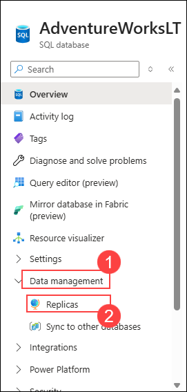
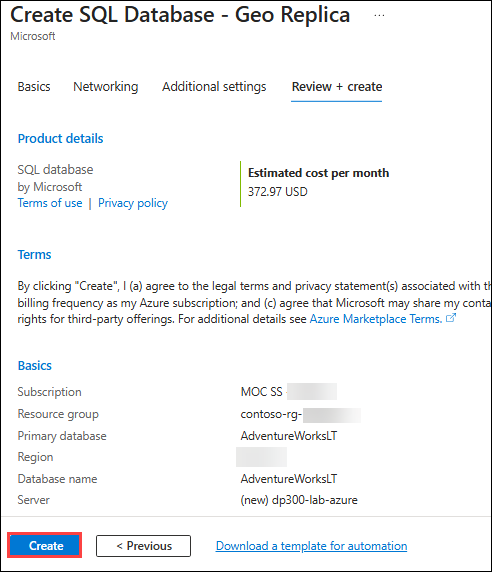
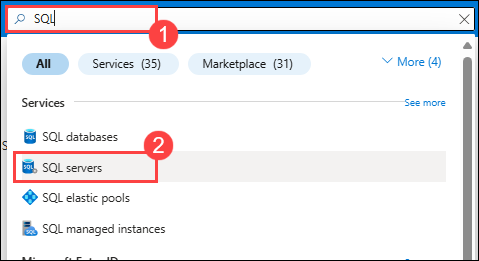
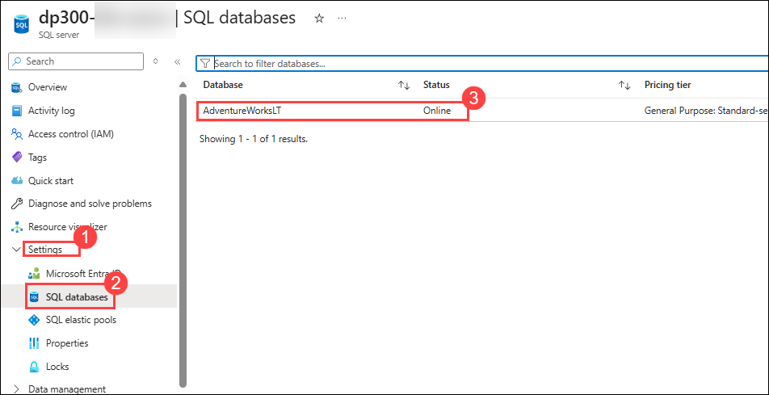
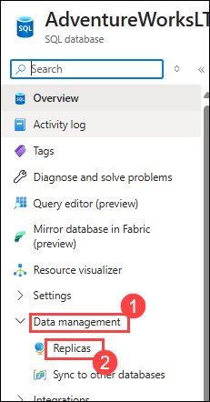

# Lab 14: Configure geo replication for Azure SQL Database

## Lab scenario
As a Database Administrator within AdventureWorks, you need to enable geo-replication for Azure SQL Database, and ensure it is working properly. Additionally, you will manually fail it over to another region using the portal.

## Lab objectives

In this lab, you will complete the following tasks:

- Task 1: Enable geo-replication
- Task 2: Failover SQL Database to a secondary region

## Estimated timing: 30 minutes

## Architecture diagram

.png)

### Task 1 - Enable geo-replication

1. In the Azure portal, navigate to your database by searching for **sql databases**.

    

1. Select the SQL database **AdventureWorksLT**.

    

1. On the blade for the database, in **Data management (1)** section, select **Replicas (2)**.

    

1. Select **+ Create replica**.

    

1. On the **Create SQL Database - Geo Replica** page under **Database details** and under **Server**, select the **Create New** link.

    

    
    >**Note:**  As we are creating a new server to host our secondary database, we can ignore the error message above.

1. On the **Create SQL Database Server** page:
   - Enter a unique **server name (1)** of your preference.
   - Select a **location (2)** as the target region.
   - In **Authentication method(3)** select **Use SQL authentication (4)**.
   - Enter a valid **server admin login (5)**, and a secure **password (6)**.
   - Select **OK (7)** to create the server.

    

1. Back in to the **Create SQL Database - Geo Replica** page, select **Review + Create**.

    

1. Select **Create**.

    

1. The secondary server and the database will now be created. To check the status, look under the notification icon at the top of the portal. 

    

1. If successful, it will progress from **Deployment in progress** to **Deployment succeeded**.

    
    
> **Congratulations** on completing the task! Now, it's time to validate it. Here are the steps:
- Click the Lab Validation tab located at the upper right corner of the lab guide section and navigate to the Lab Validation Page.
- Hit the Validate button for the corresponding task. If you receive a success message, you can proceed to the next task. 
- If not, carefully read the error message and retry the step, following the instructions in the lab guide.
- If you need any assistance, please contact us at cloudlabs-support@spektrasystems.com. We are available 24/7 to help you out.

<validation step="f9a5df03-f694-4d36-beb3-7b69e514fb35" />
  
### Task 2 - Failover SQL Database to a secondary region

Now that the Azure SQL Database replica is created, you will perform a failover.

1. Navigate to the **SQL servers (1)** and select **SQL servers (2)** page, and notice the new server in the list. Select the **secondary server** (you may have a different server name).

    

    

1. On the blade for the SQL server, in **Settings (1)** section, select **SQL databases (2)** and then select **AdventureWorksLT (3)**.

    

1. On the SQL database main blade, in **Data management (1)** section, select **Replicas (2)**.

    

   > **Note** that the geo replication link is now established.

    

1. Select the **...** menu for the secondary server, and select **Forced Failover**.

    

    
    > **Note:** Forced failover will switch the secondary database to the primary role. All sessions are disconnected during this operation.

1. When prompted by the warning message, click **Yes**.

    

1. **Refresh** the page, The status of the primary replica will switch to **Pending** and the secondary to **Failover**. 

    

    
    > **Note:** This process can take a few minutes. When complete, the roles will switch with the secondary becoming the new primary, and the old primary the secondary.

We've seen the readable secondary database may be in the same Azure region as the primary, or, more commonly, in a different region. This kind of readable secondary databases are also known as geo-secondaries, or geo-replicas.

>**Results:** In this exercise You have now seen how to enable geo-replicas for Azure SQL Database, and manually fail it over to another region using the portal.

### Review

In this lab, you have completed:

- Enabled geo-replication
- Failover SQL Database to a secondary region
  
### You have successfully completed the lab.
